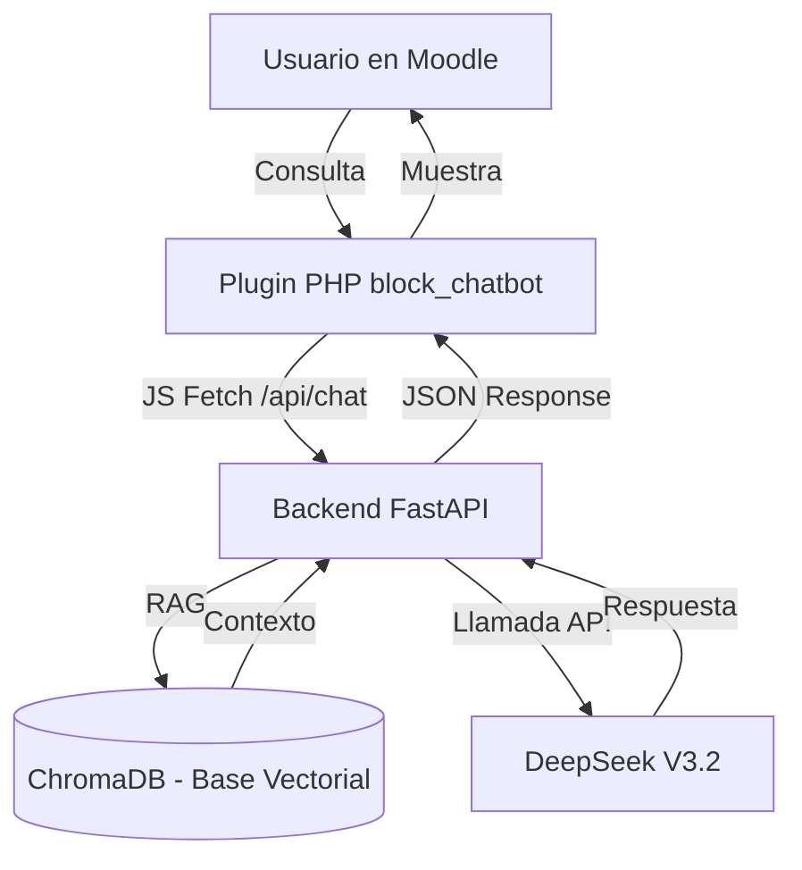

# Chatbot Moodle 🤖📚

> **Asistente Académico Virtual de Inteligencia Artificial para la plataforma Moodle.**  
> Sistema de soporte para estudiantes y docentes basado en Modelos de Lenguaje Grandes (LLM - DeepSeek) y Generación Aumentada por Recuperación (RAG - ChromaDB).

---

## 📋 Índice
1. [Resumen de la Arquitectura](#-resumen-de-la-arquitectura)
2. [Estructura del Proyecto](#-estructura-del-proyecto)
3. [Tecnologías Utilizadas](#-tecnologias-utilizadas)
4. [Requisitos Previos](#-requisitos-previos)
5. [Despliegue del Backend](#-despliegue-del-backend)
6. [Instalación del Plugin de Moodle](#-instalación-del-plugin-de-moodle)
7. [Mantenimiento y Gestión del Conocimiento](#-mantenimiento-y-gestión-del-conocimiento)
8. [Documentación Relacionada](#-documentación-relacionada)

---

## 🏛️ Resumen de la Arquitectura

El ecosistema está dividido en dos grandes bloques:

1. **Cliente (Moodle Block - Frontend):** Un plugin liviano PHP (`block_chatbot`) instalado en Moodle que inyecta un Widget flotante interactivo en Javascript (`chat.js`).
2. **Servidor (FastAPI - Backend):** Una API externa en Python que gestiona la lógica de la inteligencia artificial, aplica control de acceso y consulta una base vectorial con la documentación institucional.



---

## 📂 Estructura del Proyecto

```text
chatbot-moodle/
├── Backend/                 # ---- API de FastAPI + IA (Python) ----
│   ├── app/                 # Lógica de la aplicación
│   │   ├── models/          # Esquemas Pydantic para peticiones
│   │   ├── routes/          # Endpoints (POST /chat)
│   │   ├── services/         # Servicios de LLM, RAG y Control de Acceso
│   │   └── config.py        # Configuración de variables de entorno
│   ├── knowledge/           # Docs corporativos (PDF, TXT, MD)
│   ├── scripts/             # Indexador de documentos (index_docs.py)
│   ├── tests/               # Pruebas unitarias
│   ├── Dockerfile           # Receta de Contenedorización
│   ├── docker-compose.yml   # Orquestación de contenedores
│   └── requirements.txt     # Dependencias de Python
│
├── moodle/                  # ---- Plugin para Moodle (PHP/JS) ----
│   └── blocks/chatbot/
│       ├── amd/src/         # Código JS del Widget (chat.js)
│       ├── lang/            # Traducciones del plugin
│       ├── settings.php     # Pantalla de configuración del administrador
│       ├── version.php      # Metadatos del plugin
│       └── block_chatbot.php# Lógica principal del bloque Moodle
│
├── chatbot-moodle-guia-implementacion.md # Guía técnica detallada
└── PASOS-FALTANTES-DESPLIEGUE.md         # Checklist para producción
```

---

## 🛠️ Tecnologías Utilizadas

### **Backend:**
- **[FastAPI](https://fastapi.tiangolo.com/):** Framework de Python de alto rendimiento para APIs.
- **[DeepSeek LLM](https://platform.deepseek.com):** Modelo de lenguaje para procesamiento y generación de respuestas.
- **[ChromaDB](https://www.trychroma.com/):** Base de datos vectorial para el almacenamiento y búsqueda de documentos (RAG).
- **[LangChain](https://www.langchain.com/):** Framework de orquestación de prompts y segmentación de documentos.

### **Frontend / Plugin:**
- **Moodle Web Services API / PHP**: Integración del plugin en la plataforma.
- **JavaScript Moderno (ES6)**: Widget flotante de interacción asíncrona.

---

## 🔑 Requisitos Previos

### Backend:
- Servidor Ubuntu 22.04 LTS (2 GB RAM mínimo, 4 GB recomendado).
- Docker y Docker-Compose v2+.
- **API Key de DeepSeek**.

### Moodle:
- Versión 3.9 o superior.
- Acceso de administrador para habilitar Web Services y registrar plugins.

---

## 🚀 Despliegue del Backend

### 1. Clonar/Subir código al servidor
Copia la carpeta `/Backend` de este repositorio al directorio deseado en tu servidor (ej. `/var/www/chatbot-backend`).

### 2. Configurar variables de entorno
Cree una copia de `.env.example` y rellene con credenciales reales:
```bash
cp .env.example .env
nano .env
```
_Campos claves:_ `DEEPSEEK_API_KEY`, `API_TOKEN`.

### 3. Agregar base de conocimiento técnica
Coloque documentos `.pdf`, `.txt` o `.md` de reglamentos, manuales de Moodle o FAQs institucionales en:
`Backend/knowledge/docs/`

### 4. Indexar archivos e Iniciar Backend
```bash
# Indexar documentos en ChromaDB
docker compose run --rm chatbot python scripts/index_docs.py

# Levantar el Backend (Puerto 8000 por defecto)
docker compose up -d
```

> 💡 **Relevancia para Producción:** Se aconseja habilitar un proxy inverso como **Nginx** con TLS/SSL (**Certbot**) para asegurar la API con `https://`.

---

## 🧩 Instalación del Plugin de Moodle

1. Empaqueta el plugin en un comprimido `.zip`:
   ```bash
   cd moodle/blocks/
   zip -r block_chatbot.zip chatbot/
   ```
2. Entra a Moodle como **Administrador** e instálalo en:  
   `Administración del sitio` ➔ `Plugins` ➔ `Instalar plugin`.
3. Configura el backend tras la instalación en:  
   `Administración del sitio` ➔ `Plugins` ➔ `Bloques` ➔ `Chatbot`.
   - **URL del Backend:** `https://tu-backend.com/api`
   - **Token de Autenticación:** El mismo valor de `API_TOKEN` usado en el Backend.
4. **Habilitar**: Ve al curso o portada que desees, activa la edición y añade un bloque llamado **Chatbot**.

---

## 🔄 Mantenimiento y Gestión del Conocimiento

Para agregar nuevos manuales o guías de estudios al chatbot:
1. Sube el documento a `Backend/knowledge/docs/`.
2. Ejecuta nuevamente la re-indexación:
   ```bash
   docker compose run --rm chatbot python scripts/index_docs.py
   ```
_La persistencia vectorial de ChromaDB actualizará los datos sin necesidad de reiniciar el servidor._

---

## 📚 Documentación Relacionada
- [Guía de Implementación Técnica Detallada](./chatbot-moodle-guia-implementacion.md)
- [Checklist para Despliegue en Producción](./PASOS-FALTANTES-DESPLIEGUE.md)

---
*Moodle Chatbot v1.0.0 — Todos los derechos reservados.*
